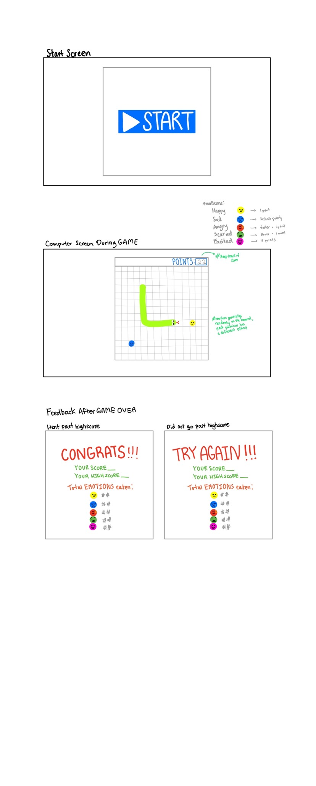

:warning: Everything between << >> needs to be replaced (remove << >> after replacing)
# CS110 Project Proposal
# Tomato Snakes
## CS 110 Final Project
### Spring, 2022
### [Assignment Description](https://docs.google.com/document/d/1H4R6yLL7som1lglyXWZ04RvTp_RvRFCCBn6sqv-82ps/edit#)

<< [repl](#) >>

<< [[link to demo presentation slides]](https://docs.google.com/presentation/d/1wEoLZi4BBrbQxKLEegGhk7z3Ufgi07y9g8fegxtoLoQ/edit#slide=id.p)(#) >>

### Team: Tomatoes
#### Yuhan Hu
#### Fuji Kashimada

***

## Project Description *(Software Lead)*

This is a snake game where a snake will be eating randomly generated emotions. It gets bigger every time it consumes emotions. Different emotions have different effects on the snake. Users have to try their best to not let the snake hit the wall or itself.

***    

## User Interface Design *(Front End Specialist)*

* 
  * For example, if your program has a start screen, game screen, and game over screen, you should include a wireframe / screenshot / drawing of each one and a short description of the components
    * Screens.py
      * Genrates start screen in the beginning when run is clicked
      * Generates play board when start button is pressed
      * Generates end screen when game is over
    * SnakeParts.py
      * Create snake drawings 
    * Emotions.py
      * Create emotion drawings

***        

## Program Design *(Backend Specialist)*

* Non-Standard libraries
    * Pygame
      * https://www.pygame.org/docs/
    * 
    * For each additional module you should include
        * url for the module documentation
        * a short description of the module
* Class Interface Design
    * 
    * This does not need to be overly detailed, but should show how your code fits into the Model/View/Controller paradigm.
* Classes
    * Controllor
      * Controls the overall game, including start the game and respond to event etc.
    * Emotions
      * Randomly generate type of emotion and their location; also like different type of emotion to different effects to the snake
    * Screens
      * Generate start, playing, and end screen.
    * SnakeBodyParts
      * Initilize the position & status of all the body parts; update the location of the body parts based on the position of the head.
    * SnakeParts
      * Initialize the snake; change the status & location of the head based on user input.

## Project Structure *(Software Lead)*

The Project is broken down into the following file structure:
* main.py
* src
    * Screen.py
      * Class that controls the starting, playing, & ending screen.
    * SnakeBodyParts.py
      * Class that assembles all the pieces of snake & updates the direction & location of the pieces based of user input & that of the previous piece.
    * SnakeParts.py
      * Class that initialize the position & picture of the sanke pieces. It also updates the image based on the direction
    * Emotions.py
      * Relate emotions with effects & generate random emotion type & locationfor playboard to input.
* assets
    * Emotion
      * All the images relate to emotions
    * Screen
      * All the images relate to screens
    * SnakeParts
      * All the images relate to snake
* etc
    * GUI Example
    * Class Diagram

***

## Tasks and Responsibilities *(Software Lead)*

   * You must outline the team member roles and who was responsible for each class/method, both individual and collaborative.

### Software Lead - None

<< Worked as integration specialist by... >>

### Front End Specialist - Fuji

All the diaplay of this game. Classes inclues Screens. Also responseble for all the drawing of this game.

### Back End Specialist -  Yuhan 

All the logic of this game. Classes inclues Controller, Emotions, SnakeBodyParts, SnakeParts, and score keeping in the screen class.

## Testing *(Software Lead)*

* << Describe your testing strategy for your project. >>
    * << Example >>

## ATP

| Step                  | Procedure     | Expected Results  | Actual Results |
| ----------------------|:-------------:| -----------------:| -------------- |
|  1  | Click on Run Button  | Display start screen  |          |
|  2  | Click on the Start Button | Start screen disappears and display play board |                 |
|  3  | Press on Up key | Snake move Up  |          |
|  4  | Press on Down key  | Snake move Down  |          |
|  5  | Press on Left key | Snake move Left  |          |
|  6  | Press on Right key | Snake move Right  |          |
|  7  | Snake eating Happy emotion  | Add 1 point to total score  |          |
|  8  | Snake eating Angry emotion  | Add 1 point to the total score; Sanke move faster  |          |
|  9  | Snake eating Sad emotion  | Deduct 1 point from the total score   |          |
|  7  | Snake eating Scared emotion  | Snake becomes slower and 1 point is added to the total score  |          |
|  8  | Snake eating Excited emotion  | Add 4 points to total score  |          |
|  9  | Snake hitting wall | Snake dies and the game is over  |          |
|  10  | Snake hitting itself | Snake dies and the game is over  |          |
|  11  | Display the final screen | If current score higher thatn history highest score, Congrats screen; else Try Again screen |          |
|  12  | Click on Retry Button  | Playboard display again; Game start again  |          |
